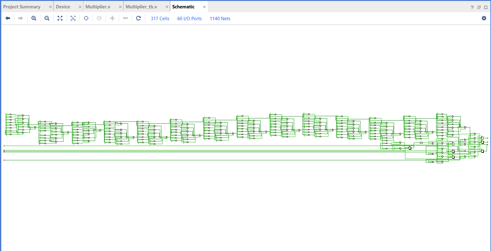
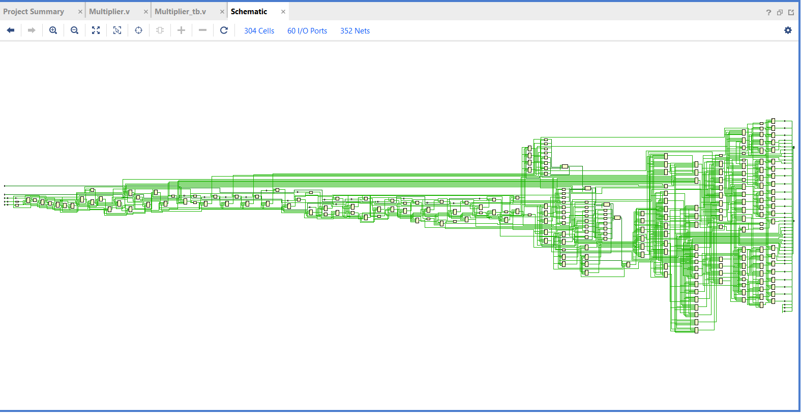
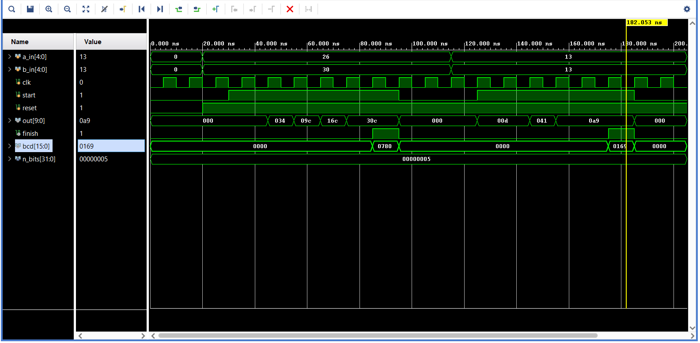

# Parameterized Shift-and-Add Multiplier with Double Dabble Binary-to-BCD Converter in Verilog HDL

A parameterized digital arithmetic core in Verilog HDL featuring an **$N$-cycle Shift-and-Add Binary Multiplier** coupled with an integrated **Double Dabble (Shift-and-Add-3) Binary-to-BCD Converter**. The design computes the binary product of two $N$-bit unsigned operands and converts the $2N$-bit binary result into packed Binary Coded Decimal (BCD) format ready for multi-digit 7-segment or decimal displays.

---

## 1. Overview

Binary multiplication and decimal conversion are core arithmetic functions in embedded processors, digital signal processing (DSP) units, instrumentation displays, and digital calculators. While binary multipliers produce pure positional binary products, driving human-readable decimal readouts requires converting these binary outputs into BCD.

This project implements a complete two-phase arithmetic datapath:
1. **Multiplication Phase (Shift-and-Add Algorithm)**: Multiplies two $N$-bit unsigned inputs (`a_in`, `b_in`) sequentially over $N$ clock cycles using conditional addition and shift registers, minimizing hardware resource consumption compared to large combinational multiplier arrays.
2. **Decimal Conversion Phase (Double Dabble Algorithm)**: Evaluates the $2N$-bit binary product in an unrolled shift-and-add-3 network, checking each 4-bit BCD nibble for values $\ge 5$, adding 3 when true, and shifting left across $2N$ iterations to generate a fully packed BCD output word.

The architecture is parameterized by operand bit-width $N$ and has been verified via behavioral simulation and synthesized using **AMD Vivado**.

---

## 2. Key Architectural Features

- **Parameterized Operand Width ($N$)**: Fully scalable input operand widths (default $N = 8$; instantiated with $N = 5$ in verification).
- **Resource-Efficient Sequential Multiplication**: Computes a full $2N$-bit product across $N$ clock cycles using a single adder and shift registers rather than dedicated DSP blocks or sprawling array logic.
- **Hardware Double Dabble BCD Conversion**: Automatically initiates upon multiplication completion, performing unrolled combinational shift-and-add-3 operations to produce packed BCD digits.
- **Predictable Status Signaling**: Generates an active-high `finish` flag signaling the availability of valid binary (`out`) and BCD (`bcd`) outputs.
- **Asynchronous Active-Low Reset**: Independent `!reset` clearing registers to defined zero states.
- **Dual-Phase Control via `start`**:
  - `start = 0`: Synchronously captures input operands into shift registers and primes the counter.
  - `start = 1`: Initiates iterative shift-and-add computation.
- **Synthesizable RTL Design**: Verified through RTL elaboration and gate-level synthesis in AMD Vivado.

---

## 3. Repository Structure

```text
.
├── Multiplier.v              # RTL implementation of parameterized multiplier & BCD converter
├── Multiplier_tb.v           # Behavioral testbench validating test vectors (N = 5)
├── Elaborated_Design.png     # Vivado RTL elaboration schematic (317 cells, 60 I/O ports)
├── Sythesized_Schematic.png  # Vivado post-synthesis technology schematic (304 cells)
├── waveform.png              # Vivado simulation waveform (test cases 26x30 and 13x13)
└── README.md                 # Project documentation
```

---

## 4. Architectural Block Diagram & Signal Interface

```
                          +----------------------------------------------+
                          |                  Multiplier                  |
                          |                (Parameter N)                 |
        clk ------------->| clk                                      out |---> [(2*N)-1:0] (Binary Product)
      reset ------------->| reset (active-low)                    finish |---> [0:0]       (Done Flag)
      start ------------->| start                                    bcd |---> [(((2*N)/3)+1)*4-1:0] (Packed BCD)
                          |                                              |
[N-1:0] a_in ------------>| a_in (Multiplicand)                          |
[N-1:0] b_in ------------>| b_in (Multiplier)                            |
                          +----------------------------------------------+
```

### Module Port List

| Signal Name | Direction | Bit Width | Description |
| :--- | :---: | :---: | :--- |
| `clk` | Input | `1` | System clock (rising-edge triggered) |
| `reset` | Input | `1` | Asynchronous active-low global reset |
| `start` | Input | `1` | Control input (`0` = Load inputs & reset state; `1` = Execute multiplication) |
| `a_in` | Input | `N` | $N$-bit unsigned multiplicand |
| `b_in` | Input | `N` | $N$-bit unsigned multiplier |
| `out` | Output | `2*N` | $2N$-bit full-precision binary product |
| `finish` | Output | `1` | Active-high completion flag (asserts when binary and BCD results are valid) |
| `bcd` | Output | `(((2*N)/3)+1)*4` | Packed BCD output bus with 4 bits per decimal digit |

### Parameter Definition

| Parameter | Default Value | Testbench Override | Description |
| :--- | :---: | :---: | :--- |
| `N` | `8` | `5` | Input operand bit-width |

> [!NOTE]
> **BCD Bus Width Calculation**:  
> For an unsigned binary product of $2N$ bits, the maximum value is $2^{2N} - 1$. The maximum number of decimal digits required is $\lfloor \log_{10}(2^{2N}) \rfloor + 1 \approx \lfloor \frac{2N}{3.32} \rfloor + 1$. The RTL implements this using integer arithmetic: `((2*N)/3) + 1` digits. Each decimal digit requires 4 bits (a nibble):
> $$\text{BCD Width} = \left(\left\lfloor\frac{2N}{3}\right\rfloor + 1\right) \times 4\text{ bits}$$
> - For $N = 5$: $2N = 10$ bits ($\max = 1023$). BCD digits $= (10/3) + 1 = 4$ digits $\rightarrow$ **16 bits** (`bcd[15:0]`).
> - For $N = 8$: $2N = 16$ bits ($\max = 65535$). BCD digits $= (16/3) + 1 = 6$ digits $\rightarrow$ **24 bits** (`bcd[23:0]`).

---

## 5. Working Principle & Datapath Mechanics

The datapath operates through three sequential operational phases:

### Phase 1: Operand Loading (`start = 0`)
While `start` is low:
- `a_in_reg` is loaded with multiplicand `a_in` (zero-extended to $2N$ bits).
- `b_in_reg` is loaded with multiplier `b_in` (zero-extended to $2N$ bits).
- `out_reg`, `finish_reg`, and `bcd_reg` are cleared to zero.
- Countdown counter `bits` is initialized to $N$.
- Flag `convert` is set to `0`.

### Phase 2: Shift-and-Add Multiplication (`start = 1`, `bits != 0`)
When `start` is asserted high, the circuit performs one step per clock cycle for $N$ cycles:
1. **LSB Evaluation**: The least significant bit of the multiplier register (`b_in_reg[0]`) is checked.
2. **Conditional Accumulation**: If `b_in_reg[0] == 1`, the current multiplicand is added to the product accumulator:
   $$\text{out\_reg} \Leftarrow \text{out\_reg} + \text{a\_in\_reg}$$
3. **Register Shifts**:
   - Multiplicand is shifted left: `a_in_reg <= a_in_reg << 1;`
   - Multiplier is shifted right: `b_in_reg <= b_in_reg >> 1;`
4. **Step Counter**: `bits` decrements by 1 (`bits <= bits - 1;`).
5. **Conversion Arming**: When `bits == 1` (the final multiplication cycle), the internal flag `convert` asserts high, arming the BCD conversion stage for the next cycle.

### Phase 3: Double Dabble (Shift-and-Add-3) BCD Conversion (`convert = 1`)
Once `bits == 0` and `convert == 1`, the Double Dabble algorithm converts the $2N$-bit binary value `out_reg` into packed BCD:

```verilog
bcd_temp = 0;
for (i = 0; i < (2*N); i = i + 1) begin
    if (bcd_temp[3:0] >= 5)   bcd_temp[3:0]   = bcd_temp[3:0]   + 3;
    if ((((2*N)/3)+1) > 1 && bcd_temp[7:4] >= 5)   bcd_temp[7:4]   = bcd_temp[7:4]   + 3;
    if ((((2*N)/3)+1) > 2 && bcd_temp[11:8] >= 5)  bcd_temp[11:8]  = bcd_temp[11:8]  + 3;
    if ((((2*N)/3)+1) > 3 && bcd_temp[15:12] >= 5) bcd_temp[15:12] = bcd_temp[15:12] + 3;
    if ((((2*N)/3)+1) > 4 && bcd_temp[19:16] >= 5) bcd_temp[19:16] = bcd_temp[19:16] + 3;

    // Shift left and append next binary MSB
    bcd_temp = {bcd_temp[(((2*N)/3)+1)*4-2:0], out_reg[(2*N)-1-i]};
end
bcd_reg <= bcd_temp;
finish_reg <= 1;
convert <= 0;
```

- **Why Add 3?**: In standard binary arithmetic, shifting left multiplies a value by 2. In base-10 (BCD), shifting a digit of value 5 or greater produces 10 or greater (which cannot fit in a 4-bit decimal digit $0-9$ without overflowing). Adding 3 prior to shifting ensures that $2 \times (\text{value} + 3) = 2 \times \text{value} + 6$, automatically adding the required base-16 to base-10 carry correction (+6).
- **Completion**: Once the loop evaluates all $2N$ bits, `bcd_reg` receives `bcd_temp`, `finish_reg` asserts to `1`, and `convert` clears to `0`.

---

## 6. RTL Elaboration & Synthesis Schematics

### Elaborated RTL View

*Figure 1: Vivado elaborated schematic for `Multiplier` ($N = 8$). Displays 317 cells, 60 I/O ports, and 1,140 nets. The horizontal cascade demonstrates the unrolled combinational loop of conditional add-3 blocks and shift multiplexers generating the multi-digit BCD outputs.*

### Synthesized Gate-Level Technology View

*Figure 2: Vivado post-synthesis technology schematic (304 cells, 60 I/O ports, 352 nets). Displays the mapping into FPGA Slice Look-Up Tables (LUTs) implementing the Double Dabble correction network and flip-flops (`FDRE`) implementing the shift registers and accumulator stages.*

---

## 7. Behavioral Verification & Waveform Analysis

The testbench [`Multiplier_tb.v`](Multiplier_tb.v) configures `n_bits = 5` ($N = 5$, $2N = 10$ bits) and applies a 100 MHz clock (`10 ns` period, `#5 clk = ~clk`).

### Simulation Waveform Breakdown

*Figure 3: AMD Vivado behavioral simulation waveform demonstrating execution of Test Case 1 ($26 \times 30$) and Test Case 2 ($13 \times 13$).*

### Test Case 1 Walkthrough: $26 \times 30 = 780$ (`10'h30c`, BCD `0780`)
- **Operands**: `a_in = 26` (`5'b11010`), `b_in = 30` (`5'b11110`).
- **Clock-by-Clock Accumulation**:
  - *Cycle 1 ($t = 35\text{ ns}$)*: `b_in_reg[0] = 0` $\rightarrow$ `out` remains `10'h000`. `a_in_reg` shifts to $52$ (`0x34`), `b_in_reg` shifts to $15$.
  - *Cycle 2 ($t = 45\text{ ns}$)*: `b_in_reg[0] = 1` $\rightarrow$ adds 52 $\rightarrow$ `out = 10'h034`.
  - *Cycle 3 ($t = 55\text{ ns}$)*: `b_in_reg[0] = 1` $\rightarrow$ adds 104 (`0x68`) $\rightarrow$ `out = 10'h09c` ($156$).
  - *Cycle 4 ($t = 65\text{ ns}$)*: `b_in_reg[0] = 1` $\rightarrow$ adds 208 (`0xd0`) $\rightarrow$ `out = 10'h16c` ($364$).
  - *Cycle 5 ($t = 75\text{ ns}$)*: `b_in_reg[0] = 1` $\rightarrow$ adds 416 (`0x1a0`) $\rightarrow$ `out = 10'h30c` ($780$).
- *Conversion Cycle ($t = 85\text{ ns}$)*: Double Dabble executes; `bcd` drives `16'h0780` (digits $0, 7, 8, 0$), and `finish` pulses high.

### Test Case 2 Walkthrough: $13 \times 13 = 169$ (`10'h0a9`, BCD `0169`)
- **Operands**: `a_in = 13` (`5'b01101`), `b_in = 13` (`5'b01101`).
- **Clock-by-Clock Accumulation**:
  - *Cycle 1*: `b[0] = 1` $\rightarrow$ adds 13 $\rightarrow$ `out = 10'h00d`.
  - *Cycle 2*: `b[0] = 0` $\rightarrow$ adds 0 $\rightarrow$ `out = 10'h00d`.
  - *Cycle 3*: `b[0] = 1` $\rightarrow$ adds 52 (`0x34`) $\rightarrow$ `out = 10'h041` ($65$).
  - *Cycle 4*: `b[0] = 1` $\rightarrow$ adds 104 (`0x68`) $\rightarrow$ `out = 10'h0a9` ($169$).
  - *Cycle 5*: `b[0] = 0` $\rightarrow$ adds 0 $\rightarrow$ `out = 10'h0a9` ($169$).
- *Conversion Cycle ($t = 182\text{ ns}$)*: Double Dabble completes; `bcd` drives `16'h0169` (digits $0, 1, 6, 9$), and `finish` asserts to `1` (indicated by the yellow cursor).

---

## 8. Synthesis & Implementation Observations

| Design Attribute | Multiplier Module Implementation | Hardware Implication |
| :--- | :--- | :--- |
| **Arithmetic Primitive** | Sequential single adder (`out_reg + a_in_reg`) | Replaces large $N \times N$ multiplier trees or DSP slices with a lightweight adder and shift registers |
| **BCD Conversion** | Unrolled combinational for-loop over $2N$ iterations | Synthesizes into a cascade of LUT4/LUT6 cells implementing $\ge 5$ comparators and $+3$ adders |
| **Latency Profile** | $N$ cycles (multiplication) $+ 1$ cycle (BCD conversion) | Fixed latency of $N + 1$ clock cycles from `start = 1` to `finish = 1` |
| **Logic Cell Count** | 317 elaborated cells $\rightarrow$ 304 synthesized cells | Modest logic footprint easily accommodated on entry-level FPGA slices |
| **Clock / Reset Tree** | Single global clock `clk`, asynchronous `!reset` | Standard flip-flop asynchronous preset/clear routing |

> [!NOTE]
> Physical timing constraint files (`.xdc`) and pin mappings were not included in the repository. The core is designed as a reusable arithmetic macro for integration into larger SoC designs or digital display controllers.

---

## 9. Engineering Takeaways & Trade-offs

1. **Sequential vs. Combinational Multiplication**:
   - A fully combinational multiplier computes the product in a single clock cycle at the expense of significant area and a long critical path delay ($O(N^2)$ logic growth).
   - This shift-and-add architecture trades throughput for area, consuming only $O(N)$ register and adder resources at a cost of $N$ clock cycles.
2. **Unrolled Combinational Double Dabble Timing**:
   - Implementing Double Dabble inside an unrolled for-loop completes the entire conversion in a single clock cycle.
   - However, because each shift iteration depends on the comparison and sum of the preceding iteration, the propagation delay scales with $2N$. For large bit-widths ($N \ge 16$), pipelining or sequentially iterating the Double Dabble stage is recommended to preserve high maximum clock frequencies ($F_{\max}$).
3. **Carry Correction Mechanism**:
   - The conditional addition of 3 is a direct consequence of the binary base ($16 = 2^4$) exceeding decimal base 10 by 6: since the value will be multiplied by 2 on the subsequent shift, adding 3 beforehand yields $3 \times 2 = 6$, compensating for the hexadecimal-to-decimal carry gap.

---

## 10. Limitations & Future Enhancements

- **Dedicated FSM Controller**: Replacing procedural state variables (`bits`, `convert`) with an explicit three-state Finite State Machine (`IDLE`, `CALC`, `CONVERT`, `DONE`) to further enhance formal verification readiness.
- **Signed Multiplier Support**: Implementing 2's complement Booth's Algorithm or sign-extension pre-processing for signed arithmetic.
- **Iterative Sequential BCD Converter**: Converting the unrolled Double Dabble loop into a multi-cycle sequential engine to prevent critical path elongation at larger operand bit-widths ($N \ge 16$).
- **Direct 7-Segment Cathode Decoder**: Adding an output decoder mapping the packed BCD digits directly onto multiplexed 7-segment display cathodes.

---

## 11. Tools Used

| Tool | Purpose |
| :--- | :--- |
| **Verilog HDL (IEEE 1364-2001)** | Hardware description of multiplier datapath and testbench |
| **AMD Vivado Design Suite** | RTL elaboration, behavioral simulation, and gate-level synthesis |
| **Git / GitHub** | Version control and repository hosting |

---

## 12. Author

Created by **Chethan Aithal**  
*Shift-and-Add Multiplier and Double Dabble BCD Converter Project for Digital Arithmetic and FPGA Learning.*
